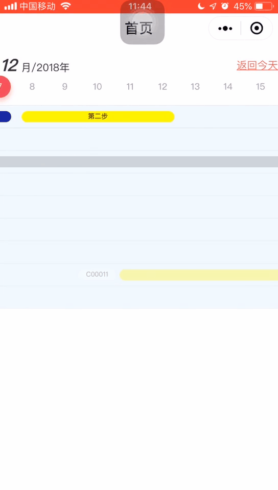
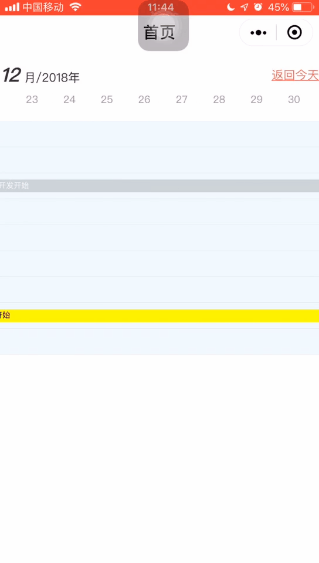
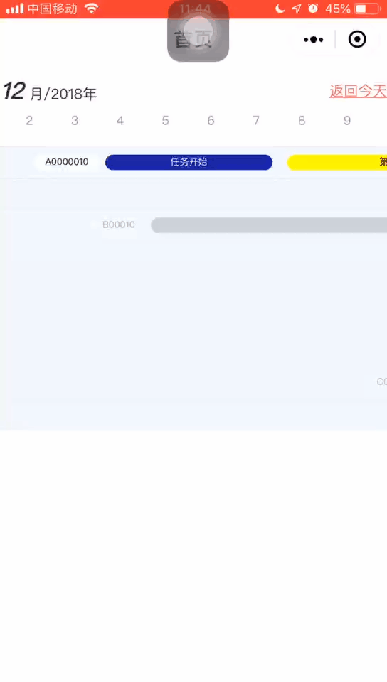

# SOP 任务流程组件

微信基础最低版本: 2.0.0

# 组件参数

|属性|说明|类型|必填|备注|
|--|--|--|--|--|
|tasks|任务列表|String/Number|是||
|selected|默认选择的时间|String|否|moment().format('YYYY-MM-DD')|
|prevMonthLength|当前月份向前加载多少个月份|Number|否||
|nextMonthLength|当前月份向后加载多少个月份|Number|否||

## tasks[0]

|属性|说明|类型|必填|备注|
|--|--|--|--|--|
|id|唯一标识|String/Number|是||
|name|任务名|String|是||
|steps|任务步骤|Array|是|看下面详情|

## steps[0]

|属性|说明|类型|必填|备注|
|--|--|--|--|--|
|id|唯一标识|String/Number|是||
|startDate|开始时间|String|是||
|endDate|结束时间|String|是||
|backgroundColor|背景颜色|String|是||
|text|文字|String|否||
|color|文字|String|否||
|styleType|任务框样式|String|否|默认：circle|

# 效果

